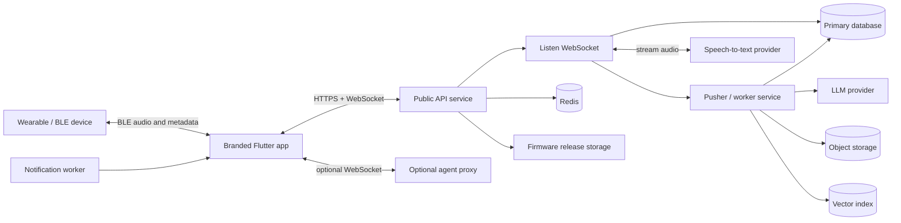

# Custom Backend From Scratch

This manual is for a mildly technical builder who wants to create their own branded mobile app and their own backend instead of depending on Omi's hosted services. It explains the backend work from first principles, while using this repository as a feature reference.

The repository already contains a full product: a Flutter mobile app, a FastAPI backend, real-time audio WebSockets, a pusher service, speaker-analysis services, firmware support, app integrations, and deployment assets. Building your own version means you should make explicit product, legal, brand, infrastructure, and security decisions rather than silently inheriting assumptions from the reference implementation.

## What "from scratch" means here

For this guide, "from scratch" means:

1. You create your own product name, logo, colors, bundle IDs, domains, privacy policy, and terms.
2. You create your own cloud accounts, databases, API keys, object-storage buckets, authentication project, and deployment pipeline.
3. You write and operate your own backend code.
4. You either rewrite the mobile client to call your API or keep the existing mobile app shape and implement compatible API contracts.
5. You support external devices by defining device identity, BLE/audio behavior, firmware release metadata, and update flows.

<Note>
This is a backend manual. It mentions mobile and firmware work only where backend design depends on them.
</Note>

## The major decision before you write code

Choose one of these paths before starting:

| Path | What it means | Best for |
| --- | --- | --- |
| Compatible backend | Keep the current Flutter app mostly intact and implement endpoints that match its current expectations. | Fastest way to get a branded app working from this repository. |
| Clean new API | Rewrite the mobile API layer and design your own endpoints, schemas, and app flows. | Long-term ownership, simpler backend contracts, less legacy behavior. |
| Hybrid | Start compatible for login, user profiles, audio, and conversations; redesign secondary features later. | Most practical custom-product path. |

If you are new to backend development, use the hybrid path. Build a small set of compatible endpoints first, confirm the app can sign in and stream audio, then replace or simplify feature areas one by one.

## Repository features your backend may need to support

The reference product includes these backend-facing features:

| Feature area | Backend responsibility |
| --- | --- |
| Authentication | Verify Firebase ID tokens, support Google/Apple login, manage user records. |
| User profile and settings | Store name, language, permissions, preferences, subscription flags, and device settings. |
| Device connection | Track paired wearable devices, battery, firmware model/version, and connection metadata. |
| Live audio transcription | Accept WebSocket audio, stream it to speech-to-text, return transcript events in real time. |
| Conversation processing | Turn transcript segments into summaries, titles, memories, action items, and searchable records. |
| Pusher/background worker | Process conversations and speaker samples outside the listen WebSocket. |
| Memories | Store long-lived facts and preferences extracted from conversations or manually added by the user. |
| Chat | Answer user questions using LLMs and the user's conversations, memories, calendar, tasks, and files. |
| Speaker recognition | Store speech samples, create embeddings, match speakers in later sessions. |
| Sync/offline capture | Accept delayed audio or transcript uploads from the phone or device storage. |
| Firmware updates | Publish latest firmware versions and release assets per device model. |
| Push notifications | Send reminders, summaries, and integration alerts. |
| Integrations | OAuth and webhook flows for calendars, task apps, Notion, Slack, email, and other apps. |
| Payments | Plans, usage limits, Stripe checkout, billing webhooks, and entitlements. |
| Developer APIs | API keys, app marketplace, webhooks, and optional MCP endpoints. |
| Agent proxy | Optional WebSocket bridge from app to a user-owned agent VM or service. |

You do not need all of this to launch a useful app. The smallest useful backend is authentication, users, live audio transcription, saved conversations, and a simple chat endpoint.

## Recommended architecture

Use separate services when a feature has a different performance or reliability profile.



### Suggested technology choices

You can choose other tools, but this stack matches the repository and is approachable:

| Layer | Recommendation | Why |
| --- | --- | --- |
| API framework | Python 3.11 + FastAPI | Async WebSockets, OpenAPI docs, close to the reference backend. |
| Primary database | Firestore or PostgreSQL | Firestore matches current mobile/backend assumptions; PostgreSQL is easier for relational reporting. |
| Cache/locks | Redis | WebSocket locks, rate limits, session state, background queues. |
| Object storage | Google Cloud Storage, S3, or R2 | Raw audio, speech profiles, attachments, firmware binaries. |
| Authentication | Firebase Auth | Current app already uses Firebase ID tokens. |
| Speech-to-text | Deepgram, AssemblyAI, Whisper-hosted service, or self-hosted model | Live streaming audio needs low latency. |
| LLM | OpenAI, Anthropic, Gemini, or compatible gateway | Conversation summaries, memories, chat. |
| Vector search | Pinecone, pgvector, Typesense, Weaviate, or Qdrant | Semantic search over memories and conversations. |
| Jobs | Separate worker process, Cloud Run job, Celery, RQ, or Pub/Sub | Conversation processing should not block WebSocket sessions. |
| Deployment | Docker + Cloud Run to start; Kubernetes when needed | Simple first deployment, scalable later. |

## Phase 1: Define your product and backend boundary

### Step 1. Name your product and technical identifiers

Create a short document with:

- Product name.
- App display name.
- API domain, for example `https://api.yourbrand.com`.
- WebSocket domain, usually the same host with `wss://`.
- iOS bundle ID, for example `com.yourcompany.yourapp`.
- Android application ID, for example `com.yourcompany.yourapp`.
- Firebase project ID.
- Support email.
- Privacy policy URL.
- Terms URL.

Avoid using Omi/Friend names, bundle IDs, domains, certificates, Firebase projects, or production credentials for your custom product.

### Step 2. Decide your feature tiers

Create three lists:

1. **Launch core**
   - Sign in.
   - User profile.
   - Device pairing metadata.
   - Live transcription.
   - Saved conversations.
   - Basic AI summary.
   - Basic chat over saved conversations.

2. **Full companion experience**
   - Offline audio sync.
   - Speaker recognition.
   - Memories.
   - Action items.
   - Push notifications.
   - Firmware update metadata.
   - Calendar/task integrations.

3. **Advanced platform**
   - App marketplace.
   - Developer API keys.
   - Webhooks.
   - Payments.
   - Agent proxy.
   - Self-hosted speech/diarization models.

This prevents the first backend version from becoming too large to test.

### Step 3. Choose compatibility level with the current app

If you keep much of the current Flutter app, plan to provide at least:

- `API_BASE_URL` in the app environment file.
- Firebase token verification.
- HTTP endpoints for user bootstrap, conversations, memories, chat, sync, firmware, and settings.
- A WebSocket compatible with `/v4/listen`.
- Server-to-client WebSocket events compatible with the app's parser.

If you rewrite the mobile API layer, still keep the same backend concepts: users, devices, sessions, audio streams, transcripts, conversations, memories, and jobs.

## Phase 2: Create cloud accounts and local development tools

### Step 4. Create your cloud project

Create one cloud project for development and one for production. In Google Cloud/Firebase, enable:

- Firebase Authentication.
- Cloud Firestore or your chosen database.
- Cloud Storage.
- Cloud Run or Kubernetes.
- Secret Manager.
- Cloud Logging.
- Cloud Build or your CI/CD provider.

If using Firebase/Firestore, create composite indexes for any multi-field query. The reference backend needs indexes for API key queries such as `user_id` ascending plus `created_at` descending. Your own schemas may need different indexes.

### Step 5. Create Firebase Authentication

In Firebase Console:

1. Enable Google sign-in.
2. Enable Apple sign-in if you support iOS sign-in with Apple.
3. Register your Android app with your Android package ID.
4. Register your iOS app with your iOS bundle ID.
5. Download platform config files for your custom app.
6. Add SHA-1/SHA-256 fingerprints for Android debug and release keys.

Backend requirement: every authenticated request should include a Firebase ID token in:

```http
Authorization: Bearer <firebase-id-token>
```

Your backend verifies the token, extracts `uid`, and uses that `uid` as the owner for all user data.

### Step 6. Create third-party service accounts

Start with the minimum:

- Speech-to-text provider key.
- LLM provider key.
- Redis instance.
- Object-storage bucket.
- Error monitoring project.

Add later:

- Vector database.
- Stripe.
- Twilio or phone-call provider.
- Push-notification keys.
- OAuth credentials for each integration.
- GPU service provider for diarization and speaker embeddings.

### Step 7. Create local environment files

Use separate environment files per environment:

```bash
.env.local
.env.dev
.env.prod
```

Minimum variables:

```bash
ENVIRONMENT=local
API_BASE_URL=http://localhost:8000
PUBLIC_API_BASE_URL=https://your-ngrok-or-dev-domain.example

FIREBASE_PROJECT_ID=your-firebase-project
GOOGLE_APPLICATION_CREDENTIALS=./google-credentials.json

DATABASE_URL=
REDIS_URL=
OBJECT_STORAGE_BUCKET=your-dev-bucket

STT_PROVIDER=deepgram
DEEPGRAM_API_KEY=

LLM_PROVIDER=openai
OPENAI_API_KEY=

ENCRYPTION_SECRET=generate-a-long-random-secret
ADMIN_KEY=local-dev-only-secret
```

Never commit real `.env` files.

## Phase 3: Scaffold the backend repository

### Step 8. Create the backend structure

A simple structure:

```text
backend/
  app/
    main.py
    config.py
    auth.py
    logging.py
    errors.py
    api/
      health.py
      users.py
      devices.py
      conversations.py
      memories.py
      chat.py
      listen.py
      sync.py
      firmware.py
      integrations.py
      notifications.py
    models/
      user.py
      device.py
      conversation.py
      memory.py
      chat.py
    repositories/
      users.py
      devices.py
      conversations.py
      memories.py
      api_keys.py
    services/
      stt.py
      llm.py
      conversation_processor.py
      embeddings.py
      object_storage.py
      push_notifications.py
      firmware.py
      rate_limits.py
    workers/
      pusher.py
      notifications.py
  tests/
  Dockerfile
  requirements.txt
```

The reference backend separates `database/`, `utils/`, and `routers/`. If you use that pattern, keep the same rule: lower-level database code should not import high-level routers.

### Step 9. Add dependencies

For a FastAPI backend:

```bash
fastapi
uvicorn[standard]
pydantic
pydantic-settings
firebase-admin
google-cloud-firestore
google-cloud-storage
redis
httpx
websockets
python-multipart
cryptography
tenacity
pytest
pytest-asyncio
```

Add provider SDKs only when you need them. For example, add Deepgram's SDK when implementing live STT, not during the first health-check commit.

### Step 10. Implement configuration loading

Create one `Settings` object loaded from environment variables. Validate required variables at startup. Fail fast if critical variables are missing in production.

Important settings:

- `environment`
- `api_base_url`
- `firebase_project_id`
- `redis_url`
- `object_storage_bucket`
- `encryption_secret`
- `stt_provider`
- `llm_provider`
- provider API keys
- rate-limit values
- CORS origins
- allowed mobile app versions, if you enforce them

### Step 11. Implement health checks

Add:

| Endpoint | Purpose |
| --- | --- |
| `GET /health` | Returns 200 if the process is alive. |
| `GET /ready` | Checks database, Redis, and required provider configuration. |
| `GET /version` | Returns git SHA, build time, environment, and app version compatibility. |

Do this before user features so deployment problems are easy to diagnose.

## Phase 4: Authentication, users, and security

### Step 12. Verify Firebase tokens

Every protected HTTP endpoint should:

1. Read the `Authorization` header.
2. Extract the bearer token.
3. Verify it using Firebase Admin SDK.
4. Read `uid`, email, and provider claims.
5. Attach `uid` to the request context.

For WebSockets, you can authenticate in either of two ways:

1. Token in query/header before accept.
2. First message after connect: `{"type":"auth","token":"..."}`.

The reference app uses Firebase token based auth for backend calls. Match that unless you are rewriting the mobile auth layer.

### Step 13. Create the user bootstrap endpoint

Add an endpoint the app can call after sign-in:

```http
POST /v1/users/bootstrap
Authorization: Bearer <token>
```

Response:

```json
{
  "uid": "firebase-uid",
  "email": "person@example.com",
  "display_name": "Person",
  "created_at": "2026-05-08T00:00:00Z",
  "settings": {
    "language": "en",
    "timezone": "UTC",
    "private_cloud_sync_enabled": false
  },
  "entitlements": {
    "plan": "free",
    "speech_minutes_remaining": 300
  }
}
```

If the user document does not exist, create it. If it exists, update safe fields such as `last_seen_at` and app version.

### Step 14. Create a security baseline

Implement these rules early:

- Every user-owned record includes `uid`.
- The backend never trusts `uid` from a request body when a Firebase token is present.
- Logs never include raw audio, tokens, secret keys, full transcripts, emails, or names unless explicitly sanitized.
- Encrypt sensitive text at rest if your database is not already field-level encrypted.
- Use short-lived signed URLs for private files.
- Add rate limits before public launch.
- Reject unsupported app versions when schema compatibility breaks.
- Separate development, staging, and production credentials.

## Phase 5: Data model

### Step 15. Create core collections or tables

Use these names as a starting point. Adapt to Firestore, PostgreSQL, or another database.

#### users

```json
{
  "uid": "string",
  "email": "string",
  "display_name": "string",
  "photo_url": "string",
  "language": "en",
  "timezone": "America/Los_Angeles",
  "created_at": "timestamp",
  "updated_at": "timestamp",
  "last_seen_at": "timestamp",
  "subscription": {
    "plan": "free",
    "status": "active"
  },
  "settings": {
    "private_cloud_sync_enabled": false,
    "speaker_auto_assign_enabled": false,
    "memory_extraction_enabled": true
  }
}
```

#### devices

```json
{
  "id": "device-id-or-generated-id",
  "uid": "owner-uid",
  "display_name": "My Wearable",
  "model": "custom-devkit-v1",
  "firmware_version": "1.0.0",
  "hardware_revision": "rev-a",
  "serial_number_hash": "hash",
  "last_battery_percent": 82,
  "last_connected_at": "timestamp",
  "created_at": "timestamp"
}
```

#### conversations

```json
{
  "id": "conversation-id",
  "uid": "owner-uid",
  "status": "in_progress | processing | completed | failed",
  "source": "ble | phone_mic | import | phone_call",
  "started_at": "timestamp",
  "finished_at": "timestamp",
  "language": "en",
  "title": "string",
  "overview": "string",
  "emoji": "string",
  "category": "string",
  "transcript_segments": [],
  "audio_files": [],
  "structured": {
    "action_items": [],
    "events": [],
    "people": []
  },
  "created_at": "timestamp",
  "updated_at": "timestamp"
}
```

#### transcript_segments

Store these embedded in the conversation for small sessions, or as a separate collection/table for long sessions.

```json
{
  "id": "segment-id",
  "conversation_id": "conversation-id",
  "uid": "owner-uid",
  "text": "Hello there",
  "speaker": "SPEAKER_00",
  "speaker_id": "person-id-or-null",
  "is_user": false,
  "start": 0.25,
  "end": 2.1,
  "confidence": 0.95,
  "created_at": "timestamp"
}
```

#### memories

```json
{
  "id": "memory-id",
  "uid": "owner-uid",
  "text": "The user prefers morning workouts.",
  "category": "preference",
  "visibility": "private",
  "source_conversation_id": "conversation-id",
  "embedding_id": "vector-id",
  "created_at": "timestamp",
  "updated_at": "timestamp"
}
```

#### people and speech samples

```json
{
  "id": "person-id",
  "uid": "owner-uid",
  "name": "Alex",
  "relationship": "coworker",
  "speech_samples": [
    {
      "id": "sample-id",
      "embedding": [0.01, 0.02],
      "audio_uri": "gs://bucket/path.wav",
      "created_at": "timestamp"
    }
  ],
  "created_at": "timestamp"
}
```

#### firmware_releases

```json
{
  "id": "release-id",
  "device_model": "custom-devkit-v1",
  "version": "1.0.3",
  "release_notes": "Improves BLE stability.",
  "asset_url": "https://storage.example.com/firmware/custom-devkit-v1/1.0.3.zip",
  "checksum_sha256": "hex",
  "required": false,
  "created_at": "timestamp"
}
```

### Step 16. Add database repository functions

Create small functions for each operation:

- `create_user_if_missing(uid, profile)`
- `get_user(uid)`
- `update_user_settings(uid, settings)`
- `upsert_device(uid, device)`
- `create_conversation_stub(uid, metadata)`
- `append_transcript_segments(uid, conversation_id, segments)`
- `mark_conversation_processing(uid, conversation_id)`
- `complete_conversation(uid, conversation_id, structured_data)`
- `create_memory(uid, memory)`
- `list_memories(uid, filters)`

Do not let route handlers directly contain complex database code. This makes testing easier.

## Phase 6: HTTP API contracts

### Step 17. Implement the minimum mobile endpoints

Minimum launch endpoints:

| Method | Endpoint | Purpose |
| --- | --- | --- |
| `GET` | `/health` | Process health check. |
| `POST` | `/v1/users/bootstrap` | Create or fetch signed-in user. |
| `GET` | `/v1/users/me` | Fetch profile/settings. |
| `PATCH` | `/v1/users/me` | Update profile/settings. |
| `POST` | `/v1/devices` | Register or update a paired device. |
| `GET` | `/v1/devices` | List user's devices. |
| `GET` | `/v1/conversations` | List conversations. |
| `GET` | `/v1/conversations/{id}` | Fetch one conversation. |
| `DELETE` | `/v1/conversations/{id}` | Delete one conversation. |
| `POST` | `/v1/chat/messages` | Send a chat message and get an AI response. |
| `GET` | `/v1/firmware/latest` | Ask whether a device has an update. |
| `WebSocket` | `/v4/listen` | Stream live audio and receive transcript events. |

If you are trying to run the existing app with fewer changes, inspect its API client calls and add compatibility aliases where needed, for example `/v2/messages` or `/v3/memories`.

### Step 18. Standardize responses and errors

Use consistent errors:

```json
{
  "error": {
    "code": "not_found",
    "message": "Conversation not found",
    "request_id": "req_123"
  }
}
```

Common error codes:

- `unauthenticated`
- `permission_denied`
- `not_found`
- `rate_limited`
- `invalid_argument`
- `provider_unavailable`
- `internal`

### Step 19. Add request metadata

Accept and log safe metadata:

- App platform: iOS, Android, web.
- App version.
- Device ID hash.
- Request start time.
- Request ID.

Do not rely on this metadata for authorization.

## Phase 7: Live audio WebSocket

Live audio is the hardest core feature. Build it in layers.

### Step 20. Define the WebSocket contract

Recommended endpoint:

```text
wss://api.yourbrand.com/v4/listen?language=en&sample_rate=16000&codec=pcm16&channels=1&source=ble
```

Authentication options:

- Preferred: `Authorization: Bearer <firebase-token>` header.
- Browser fallback: first message is `{"type":"auth","token":"<firebase-token>"}`.

Client to server:

| Frame type | Meaning |
| --- | --- |
| Binary PCM/Opus audio | Audio stream from phone mic or wearable. |
| Binary silence keepalive | Keeps the connection alive without creating speech. |
| JSON control message | Optional events like pause, resume, end session. |

Server to client:

| Message | Example |
| --- | --- |
| Service ready | `{"type":"service_status","status":"ready"}` |
| Transcript segments | `[{"id":"seg1","text":"hello","speaker":"SPEAKER_00","start":0.0,"end":1.2}]` |
| Processing started | `{"type":"memory_processing_started"}` |
| Memory created | `{"type":"memory_created","memory":{"id":"mem1","structured":{}}}` |
| Error | `{"type":"error","code":"provider_unavailable","message":"STT unavailable"}` |
| Keepalive | `ping` |

### Step 21. Implement a simple echo WebSocket first

Before connecting speech-to-text:

1. Accept a WebSocket.
2. Authenticate the user.
3. Create a conversation record with `status=in_progress`.
4. Count received audio bytes.
5. Every few seconds, send a debug status message.
6. On disconnect, mark the conversation `completed` with no transcript.

This proves the mobile app can connect to your domain.

### Step 22. Add speech-to-text streaming

Then add a provider adapter:

```text
Mobile app -> your WebSocket -> STT provider WebSocket -> your WebSocket -> mobile app
```

The adapter should:

- Convert or pass through the audio codec expected by the provider.
- Send provider keepalives.
- Parse interim and final transcripts.
- Normalize provider output into your `transcript_segments` schema.
- Write final segments to the database.
- Return final or useful interim segments to the app.

Keep the provider-specific code out of the route handler. Create a `SttClient` interface so you can swap Deepgram, Whisper, or another provider later.

### Step 23. Track conversation lifecycle

For each listen session:

1. Create a stub conversation when the WebSocket connects.
2. Update `finished_at` when real speech segments arrive.
3. Keep `last_activity_at` for connection health.
4. If no activity arrives, close the WebSocket cleanly.
5. If enough silence follows the last speech, send the conversation to background processing.
6. Create a new stub if the same WebSocket remains open and the user starts speaking again.

Important rule from the reference backend: do not do expensive conversation processing inside the listen WebSocket. Send that work to a pusher/worker service.

### Step 24. Add duplicate connection protection

Use Redis locks:

- Key: `listen_lock:{uid}`.
- Value: WebSocket session ID.
- TTL: slightly longer than expected heartbeat interval.
- Refresh while the socket is alive.

If a second listen socket connects for the same user, either reject it or close the old session depending on your app experience.

### Step 25. Add observability for audio sessions

For each session log:

- Session ID.
- UID or anonymized UID.
- Source: BLE, phone mic, import, phone call.
- Codec and sample rate.
- Bytes received.
- STT provider connection status.
- Segment count.
- Close reason.
- Provider errors, sanitized.

Do not log raw audio or full transcript text in production logs.

## Phase 8: Pusher and background processing

### Step 26. Create a pusher/worker service

The worker owns work that can continue after the WebSocket disconnects:

- Conversation summary.
- Title and emoji.
- Action-item extraction.
- Memory extraction.
- Embedding creation.
- Private audio upload.
- Speaker sample extraction.
- Integration webhooks.

Start with a simple queue:

```json
{
  "type": "process_conversation",
  "uid": "user-id",
  "conversation_id": "conversation-id",
  "requested_at": "timestamp"
}
```

You can implement the queue using Redis Streams, Pub/Sub, SQS, Cloud Tasks, Celery, or a database table. Use WebSockets between listen and pusher only if you need low-latency bidirectional callbacks.

### Step 27. Implement conversation processing

Worker steps:

1. Load conversation and final transcript segments.
2. If there is not enough text, mark it completed with a minimal title.
3. Send transcript to an LLM using a structured output prompt.
4. Ask for:
   - title
   - short overview
   - category
   - emoji
   - action items
   - important facts to remember
5. Validate the LLM response with a schema.
6. Write structured fields to the conversation.
7. Create memory records.
8. Create action-item records.
9. Create embeddings for searchable text.
10. Mark conversation `completed`.

If processing fails, mark `failed` with a safe error code and allow retry.

### Step 28. Add idempotency

Conversation processing can be triggered more than once after reconnects or retries. Protect it:

- Only one worker can process a conversation at a time.
- Re-running the same conversation should update the same records or skip duplicates.
- Memory and action-item creation should use deterministic IDs or source references.
- Webhook delivery should use retry records and idempotency keys.

## Phase 9: Chat and retrieval

### Step 29. Implement basic chat

Endpoint:

```http
POST /v1/chat/messages
Authorization: Bearer <token>
Content-Type: application/json
```

Request:

```json
{
  "message": "What did I promise Alex yesterday?",
  "conversation_id": null
}
```

Simple response:

```json
{
  "id": "msg_123",
  "role": "assistant",
  "text": "You said you would send Alex the design review notes.",
  "sources": [
    {
      "type": "conversation",
      "id": "conv_123",
      "title": "Design review with Alex"
    }
  ]
}
```

### Step 30. Add retrieval

For useful answers:

1. Embed the user's question.
2. Search recent conversations.
3. Search memory vectors.
4. Search action items and calendar data if enabled.
5. Build a compact context for the LLM.
6. Ask the LLM to answer with citations.
7. Store the chat turn for history.

Start with database keyword search if you do not have vector search yet.

## Phase 10: Memories and action items

### Step 31. Add memory CRUD

Endpoints:

| Method | Endpoint | Purpose |
| --- | --- | --- |
| `GET` | `/v1/memories` | List memories. |
| `POST` | `/v1/memories` | Create a memory. |
| `PATCH` | `/v1/memories/{id}` | Edit text, category, or visibility. |
| `DELETE` | `/v1/memories/{id}` | Delete memory. |

Memory design rules:

- Users can delete any memory.
- Users can see why a memory exists, such as source conversation.
- The app should allow disabling automatic memory extraction.
- Sensitive memories should not be used for unrelated integrations unless the user opts in.

### Step 32. Add action items

Action items can come from LLM extraction or manual creation.

Fields:

- text
- status: open, completed, deleted
- due date
- source conversation
- assignee, if known
- external integration ID, if synced

## Phase 11: External device support

The wearable-to-phone connection usually happens over BLE and is handled by mobile and firmware code. The backend still needs to support device identity, firmware metadata, audio sync, and debugging.

### Step 33. Define device identity

Decide what the device exposes over BLE:

- Model name.
- Hardware revision.
- Firmware version.
- Serial number or random device ID.
- Battery percentage.
- Storage availability.
- Supported codecs.

For privacy, store a hashed serial number unless users need the raw serial for support.

### Step 34. Register devices from the app

When the mobile app pairs with a device, call:

```http
POST /v1/devices
```

Request:

```json
{
  "device_id": "hash-or-generated-id",
  "display_name": "My Device",
  "model": "custom-devkit-v1",
  "firmware_version": "1.0.0",
  "hardware_revision": "rev-a",
  "battery_percent": 82,
  "supported_codecs": ["pcm16", "opus"]
}
```

Backend behavior:

- Verify the user is authenticated.
- Upsert by `uid + device_id`.
- Save latest firmware and battery.
- Return feature flags for the device.

### Step 35. Support BLE audio indirectly

The backend does not usually talk to BLE devices directly. The phone receives BLE audio and forwards it to the backend listen WebSocket.

Your backend must know:

- Audio sample rate.
- Codec.
- Channel count.
- Whether frames include a firmware-specific header.
- Whether offline storage packets differ from live streaming packets.

If your firmware adds headers to audio frames, strip them in the app before sending to the backend or document them in the WebSocket decoder.

### Step 36. Add offline audio sync

Wearables may store audio when the phone is disconnected. When the phone reconnects:

1. Device streams stored audio to phone.
2. Phone creates local write-ahead-log files.
3. Phone uploads audio chunks or transcript jobs to backend.
4. Backend stores the raw audio in object storage.
5. Backend creates an async transcription job.
6. Worker transcribes and processes it like a live conversation.

Suggested endpoints:

| Method | Endpoint | Purpose |
| --- | --- | --- |
| `POST` | `/v1/sync/audio-sessions` | Create an offline upload session. |
| `PUT` | `/v1/sync/audio-sessions/{id}/chunks/{n}` | Upload one chunk. |
| `POST` | `/v1/sync/audio-sessions/{id}/complete` | Start transcription and processing. |
| `GET` | `/v1/sync/audio-sessions/{id}` | Poll processing status. |

### Step 37. Add firmware update metadata

The app needs to know if an update exists. Provide:

```http
GET /v1/firmware/latest?model=custom-devkit-v1&current_version=1.0.0
```

Response:

```json
{
  "update_available": true,
  "latest_version": "1.0.3",
  "required": false,
  "release_notes": "Improves BLE stability.",
  "asset_url": "https://storage.example.com/firmware/custom-devkit-v1/1.0.3.zip",
  "checksum_sha256": "hex"
}
```

Backend release process:

1. Build firmware in CI.
2. Produce signed artifact.
3. Upload artifact to object storage or GitHub Releases.
4. Store metadata in `firmware_releases`.
5. Optionally mark an update required for critical fixes.
6. Keep old firmware available for rollback.

### Step 38. Add device diagnostics

For support, collect user-approved diagnostics:

- App version.
- Device model.
- Firmware version.
- Last connection time.
- Last disconnect reason.
- BLE error code.
- Battery level.
- Upload queue size.

Do not collect raw audio or transcripts in diagnostics unless the user explicitly opts in.

## Phase 12: Speaker recognition and speech profiles

### Step 39. Create a speech profile flow

The user records a short sample. Backend flow:

1. App records audio.
2. App uploads audio to `/v1/speech-profile`.
3. Backend stores the audio in private object storage.
4. Backend sends audio to embedding service.
5. Backend stores the user's embedding.

### Step 40. Assign known speakers

When a user labels a transcript segment as another person:

1. App sends `segment_id` and `person_id`.
2. Backend queues speaker sample extraction.
3. Worker waits until enough audio context is available.
4. Worker extracts embedding.
5. Worker stores embedding under that person.

During future listen sessions:

1. Backend loads user and person embeddings.
2. Backend extracts embeddings from new speech windows.
3. Backend compares distance against known embeddings.
4. Backend sends `speaker_label_suggestion` events when confident.

Keep speaker recognition optional. It adds machine-learning infrastructure and privacy responsibilities.

## Phase 13: Notifications

### Step 41. Register push tokens

Endpoint:

```http
POST /v1/notifications/tokens
```

Request:

```json
{
  "platform": "ios",
  "token": "apns-or-fcm-token",
  "app_version": "1.0.0"
}
```

Store multiple tokens per user because users may have multiple devices.

### Step 42. Create notification jobs

Useful notifications:

- Conversation processing complete.
- Action item reminders.
- Daily summary.
- Integration failures.
- Firmware update available.

Every notification should respect:

- User notification settings.
- Quiet hours.
- Platform delivery limits.
- Opt-out requirements.

## Phase 14: Integrations and OAuth

### Step 43. Build one integration pattern

For each external integration:

1. Create OAuth app with redirect URI: `https://api.yourbrand.com/v1/oauth/callback/{provider}`.
2. Add `GET /v1/oauth/start/{provider}`.
3. Add `GET /v1/oauth/callback/{provider}`.
4. Store encrypted refresh tokens.
5. Add a background sync job.
6. Show connection status in the app.
7. Add disconnect/delete-token endpoint.

Do one provider first, such as Google Calendar, then reuse the pattern.

### Step 44. Protect integration data

Integration data may be more sensitive than transcripts. Add:

- Narrow OAuth scopes.
- Token encryption.
- Revocation support.
- Data deletion support.
- Clear consent screens.
- Per-integration enable/disable toggles.

## Phase 15: Payments and usage limits

### Step 45. Decide what costs money

Common billable resources:

- Speech-to-text minutes.
- LLM tokens.
- Storage.
- Integrations.
- Advanced speaker recognition.
- Developer API calls.

### Step 46. Track usage

Create usage records:

```json
{
  "uid": "user-id",
  "period": "2026-05",
  "speech_seconds": 12345,
  "llm_input_tokens": 100000,
  "llm_output_tokens": 25000,
  "storage_bytes": 987654321
}
```

Enforce limits before expensive provider calls. For live audio, check usage at connection start and periodically during the session.

### Step 47. Add Stripe later

Payment flow:

1. Create Stripe products and prices.
2. Add checkout endpoint.
3. Add customer portal endpoint.
4. Add webhook endpoint.
5. Verify webhook signature.
6. Update user entitlements from webhook events.
7. Never trust the mobile app to tell you a user paid.

## Phase 16: Developer APIs and app marketplace

Only build this after your own app is stable.

Core pieces:

- Developer API keys.
- API key scopes.
- Webhook registration.
- Webhook signing secret.
- App review workflow.
- Rate limits per developer.
- Audit logs.

For audio-streaming apps, isolate developer callbacks from the main listen session. A slow webhook should not make the user's transcription fail.

## Phase 17: Optional agent proxy

An agent proxy lets the mobile app connect to a user-specific AI agent service without exposing private VM addresses or credentials.

Design:

1. Mobile app opens `wss://agent.yourbrand.com/v1/agent/ws`.
2. Proxy verifies Firebase token.
3. Proxy looks up the user's agent service or VM in database.
4. Proxy opens an internal WebSocket to that service.
5. Proxy forwards messages both directions.
6. Proxy enforces timeouts, keepalives, and message-size limits.

Do this only if your product needs custom user agents. For normal chat, a standard HTTPS chat endpoint is simpler.

## Phase 18: Local development runbook

### Step 48. Run dependencies locally

Use Docker Compose for Redis and optional local database:

```yaml
services:
  redis:
    image: redis:7
    ports:
      - "6379:6379"
```

Run backend:

```bash
python -m venv .venv
source .venv/bin/activate
pip install -r requirements.txt
uvicorn app.main:app --host 0.0.0.0 --port 8000 --reload
```

Expose to a physical phone:

```bash
ngrok http 8000
```

Set the mobile app's `API_BASE_URL` to your public ngrok or development domain. Include a trailing slash if your app's environment code expects it.

### Step 49. Test the app connection

Test in this order:

1. `GET /health` in a browser.
2. Sign in from the app.
3. Call user bootstrap.
4. Register device metadata.
5. Open `/v4/listen` and receive `service_status`.
6. Send a short audio sample and receive transcript segments.
7. Confirm conversation appears in database.
8. Confirm worker summarizes it.
9. Ask chat a question about it.

Do not debug all features at once. Move down the list and stop at the first failure.

## Phase 19: Testing strategy

### Step 50. Unit tests

Write tests for:

- Auth token parsing.
- Settings validation.
- Repository functions.
- Conversation state transitions.
- LLM structured-output validation.
- Firmware version comparison.
- Usage-limit calculations.

### Step 51. Integration tests

Write tests that use test credentials or emulators:

- User bootstrap against test database.
- Conversation create/list/delete.
- Memory CRUD.
- Firmware latest endpoint.
- Queue publish and worker consume.
- WebSocket connect and close.

### Step 52. End-to-end tests

Run a full scenario:

1. Fresh user signs in.
2. User pairs a fake or test device.
3. App streams test audio.
4. Backend transcribes.
5. Worker processes conversation.
6. App sees completed conversation.
7. User asks chat a question.
8. User deletes the conversation.

Keep a small known audio fixture for repeatable transcription tests. Provider output can vary, so assert structure and rough content rather than exact punctuation.

## Phase 20: Deployment

### Step 53. Containerize each service

Create separate containers:

- `api`
- `pusher-worker`
- `notification-worker`
- `agent-proxy` if needed
- `diarizer` or `embedding-service` if self-hosted

Each container should expose:

- Health endpoint.
- Structured logs.
- Version metadata.
- Graceful shutdown.

### Step 54. Deploy the API

For Cloud Run:

1. Build Docker image.
2. Push to Artifact Registry.
3. Deploy with environment variables from Secret Manager.
4. Set min instances if cold starts hurt WebSocket setup.
5. Configure custom domain.
6. Enable HTTPS.
7. Set concurrency carefully for WebSockets.

For Kubernetes:

1. Create separate deployments per service.
2. Add services and ingress.
3. Configure horizontal pod autoscaling.
4. Use node pools with GPUs only for ML services.
5. Add PodDisruptionBudgets for WebSocket services.

### Step 55. Deploy workers

Workers need:

- Queue credentials.
- Database credentials.
- Provider API keys.
- Retry policy.
- Dead-letter queue.
- Alerting on stuck jobs.

Scale workers separately from the API. LLM and STT work can be slow and expensive.

### Step 56. Add monitoring and alerts

Track:

- API latency and error rate.
- WebSocket active connections.
- WebSocket disconnect reasons.
- STT provider error rate.
- Conversation processing queue depth.
- Conversation processing age.
- Worker failures.
- Redis availability.
- Database read/write errors.
- Provider spend.
- Push notification failures.

Create alerts for symptoms users notice:

- Users cannot sign in.
- Listen WebSocket cannot connect.
- Conversations stay `in_progress`.
- Queue depth keeps growing.
- STT provider errors spike.

## Phase 21: Privacy, compliance, and trust

### Step 57. Write a plain-language privacy model

Users should understand:

- What audio is streamed.
- Whether raw audio is stored.
- How long transcripts are stored.
- Whether conversations train models.
- Which third-party providers receive data.
- How to delete data.
- How to export data.
- What happens when device offline storage syncs.

### Step 58. Implement deletion

A user delete request should remove:

- User profile.
- Devices.
- Conversations.
- Transcript segments.
- Memories.
- Action items.
- Audio files.
- Speech profile audio.
- Embeddings.
- Integration tokens.
- Push tokens.
- API keys.

Use a deletion job for large accounts and show status to the user.

### Step 59. Implement export

Export:

- Profile JSON.
- Conversation JSON.
- Memories JSON.
- Action items JSON.
- Integration metadata.
- Audio links only if the user asks for audio and you can provide it securely.

## Phase 22: Production readiness checklist

Before inviting real users:

- [ ] Custom app IDs and branding are in place.
- [ ] Production Firebase project is separate from development.
- [ ] Production API uses HTTPS on your domain.
- [ ] Backend verifies Firebase tokens.
- [ ] All user records are scoped by `uid`.
- [ ] Secrets live in a secret manager, not source code.
- [ ] Logs redact tokens, PII, raw transcripts, and provider responses.
- [ ] Health and readiness checks are deployed.
- [ ] WebSocket sessions recover from provider disconnects.
- [ ] Conversation processing is done by a worker, not the listen handler.
- [ ] Stuck `in_progress` conversations are retried or surfaced.
- [ ] Usage limits exist for expensive providers.
- [ ] Data deletion works.
- [ ] Basic backup and restore process exists.
- [ ] Firmware update endpoint cannot serve the wrong model's firmware.
- [ ] Push notification tokens can be removed.
- [ ] Monitoring alerts cover sign-in, listen, processing, and provider failures.
- [ ] Privacy policy and terms match actual data behavior.

## Suggested implementation order

Use this order to avoid building advanced infrastructure before the core app works:

1. Health checks and deployment skeleton.
2. Firebase authentication.
3. User bootstrap and settings.
4. Device registration.
5. Conversation database model.
6. Basic `/v4/listen` WebSocket connection.
7. STT streaming.
8. Conversation worker.
9. Conversation list/detail endpoints.
10. Basic chat over recent conversations.
11. Memories.
12. Offline audio sync.
13. Firmware metadata.
14. Push notifications.
15. Speaker recognition.
16. Integrations.
17. Payments and usage limits.
18. Developer APIs.
19. Agent proxy.
20. Self-hosted ML services if provider cost, latency, or privacy requires them.

## Common beginner mistakes

Avoid these:

- Trying to clone every feature before sign-in and live transcription work.
- Letting the mobile app send a `uid` and trusting it.
- Doing LLM summarization inside the WebSocket handler.
- Storing provider API keys in the mobile app.
- Logging full transcripts while debugging and forgetting to remove logs.
- Skipping Redis locks and allowing multiple listen sessions to corrupt state.
- Ignoring provider failure modes until users report stuck conversations.
- Treating BLE as a backend connection. The phone is the bridge.
- Shipping firmware updates without model checks and checksums.
- Building payments before usage tracking is accurate.

## Minimal first milestone

If you need the smallest backend that proves the product can work, build only:

1. `GET /health`
2. `POST /v1/users/bootstrap`
3. `POST /v1/devices`
4. `WebSocket /v4/listen`
5. `GET /v1/conversations`
6. `GET /v1/conversations/{id}`
7. a worker that summarizes conversations
8. `POST /v1/chat/messages`

That gives you: sign-in, device awareness, live transcription, saved conversations, summary, and a simple AI assistant. Everything else can be layered on top.

## How this maps to this repository

Use these existing files as references while designing your custom backend:

- `app/.env.template` - mobile app environment variables, especially `API_BASE_URL`.
- `app/lib/backend/http/shared.dart` - authenticated request headers and token refresh behavior.
- `app/lib/providers/capture_provider.dart` - live capture and listen WebSocket usage.
- `backend/main.py` - feature routers mounted by the reference backend.
- `backend/routers/transcribe.py` - `/v4/listen` WebSocket behavior.
- `backend/pusher/` - background processing service.
- `backend/.env.template` - service credentials and optional feature keys.
- `docs/doc/developer/backend/listen_pusher_pipeline.mdx` - live listen and pusher lifecycle.
- `omi/firmware/readme.md` - firmware responsibilities and BLE/offline storage concepts.

Treat those files as a map of product behavior, not as a requirement to copy every implementation detail.
